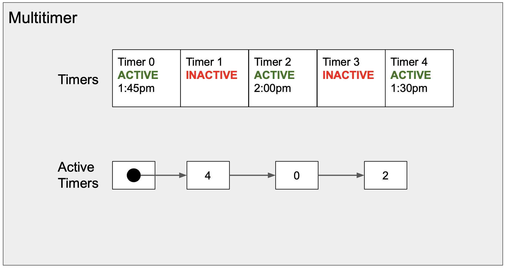

# MultiTimer in a Single Thread

# Backgrounds and Design
This project is inspired by the timers in TCP (Transmission Control Protocol). However, this project is totally independent.

The timer in TCP is created with a timeout (say 10 seconds) and a callback function (say it's foo) in the main thread. The timer runs in a separate thread and starts ticking once set. Normally the timer will expire after a certain time (10 seconds) and runs the callback function foo. However, if the main thread signals the timer before the expiration time (say 5 seconds after timer was set),  the timer will reset countdown time to 10 seconds.

The further challenge here is to implement multiple timers. A single timer is not always sufficient . For example, a typical TCP implementation needs at least 2 timers. However, it is not good to create new thread for each single timer. Obviously, we could easily run out of threads. 

It is possible to realize multiple (say 100) timers in a single thread. The idea is to have a multitimer consisting of a list of single timers, which could be actively running or not. We record a sorted list of active single timers according to their expiration time. By constantly checking the single timer with the nearest expiration time (at the head of the sorte list) and allowing it to expire (execute the callback function), we can realize multiple timers running in a single thread. We can cancel any timer any time before it expires by removing it from the active timer sorted list.




# How to run
Just compile `timer.cpp` file and run. There is a short test in the `main()` function.

```
cd .

clang++ -std=c++17 -stdlib=libc++ -g timer.cpp -o timer

./timer
```

# Main C++ techniques used
Please note the following C++ features are used in the project. I have zero C++ programming experience before. I learned all of them in this quarter. It is quite a enjoyable and intellectually challenging adventure.

## `log.h`
1. `enum`
2. Overloading `operator<<`
3. `string_view`
4. Avoid multiple inclusions with `#ifndef`

## `timer.h`
1. Namespace versioning
2. Template: general template, partial speciliazation
3. `std::function`, `std::chrono`
4. Class constructor & destructor
5. Universal reference in class template `Args&&...`
6. `std::vector`, `std::list` and their APIs
7. `mutex`, `conditional_variable`, `thread`
8. `unique_ptr`, RIGHT `const`

## `timer.cpp`
1. `std::chrono_literals`, time points, durations
2. `{fmt}` (C++20 `<format>`)
3. `this`
4. `unique_lock` and `lock_guard`
5. `std::conditional_variable::wait`, `std::conditional_variable::wait_until`
6. `cv.notify_one()`
7. Lambda functions, capture lists
8. `std::bind`
9. `std::forward`
10. `std::move`
11. Pass by reference & pass by value